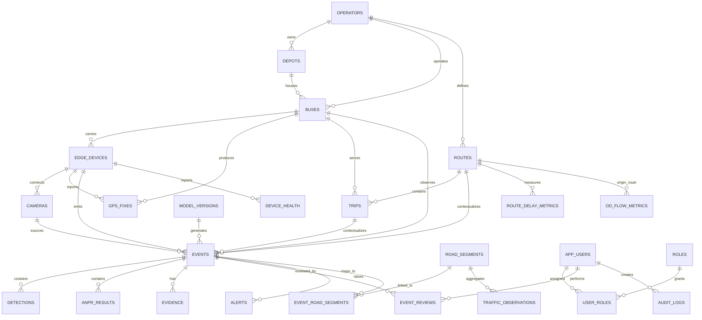

# Backend Schema

## AI-Powered Mobile Urban Intelligence Platform Using Public Transport Fleet

| Field | Value |
|---|---|
| Problem Statement ID | 26124 |
| Organization | Bharat Electronics Limited (BEL) |
| Theme | Smart Automation |
| Category | Software |
| Team | INNOVEXA |
| Backend baseline | Python API services + PostgreSQL/PostGIS |

## 1. Purpose and source basis

This backend schema translates the uploaded problem statement, SIH idea deck, and the aligned PRD/TRD/SRS into an implementation-ready central backend design. The source materials explicitly require an edge-AI platform that sends actionable, geotagged observations from buses to a centralized system that supports GIS maps, alerts, congestion heat maps, road-condition intelligence, incident/ANPR workflows, route-delay analysis, origin-destination analysis, reports, and fleet-wide analytics.

The source presentation specifies **Python-based API services**, **PostgreSQL + PostGIS**, a **React/JavaScript web GIS**, and **4G/5G/Wi-Fi** connectivity. Items such as RBAC details, exact REST routes, queue technology, retention windows, notification providers, and route/schedule interfaces are implementation assumptions/recommendations because the supplied sources do not prescribe them.

---

# 2. Backend Context

```text
Bus Cameras
   ↓
Edge AI Device
Detection · Classification · Tracking · OCR/ANPR
   ↓
Encrypted Event/Evidence Upload
   ↓
┌───────────────────────────────────────────────────────┐
│                 CENTRAL BACKEND                       │
│                                                       │
│  API Gateway / Authentication                         │
│            ↓                                          │
│  Ingestion Service ──→ Evidence Service               │
│        ↓                    ↓                         │
│  Event Service         Object Storage                 │
│        ↓                                              │
│  PostgreSQL + PostGIS                                 │
│        ↓                                              │
│  GIS / Analytics / Alert / Reporting Services         │
│        ↓                                              │
│  React Web GIS / Command Dashboard                    │
└───────────────────────────────────────────────────────┘
```

## 2.1 Suggested backend modules

| Module | Core responsibility |
|---|---|
| Authentication & RBAC | User identity, roles, authorization and protected evidence access. |
| Fleet Registry | Operators, depots, buses, edge devices, cameras and software/model versions. |
| Ingestion | Validate device identity, schema version, event ID, timestamps and geospatial metadata; enforce idempotency. |
| Event Management | Store/search road defects, infrastructure issues, traffic events, pedestrian-risk events and incidents. |
| Evidence | Register image/video evidence, hashes, storage URI and retention metadata. |
| ANPR / Incident | Store plate candidates, confidence, track metadata and incident review state. |
| GIS | PostGIS spatial queries, viewport filtering, road-segment association and map layers. |
| Traffic Analytics | Vehicle-density observations, bottlenecks, congestion aggregates and heat-map data. |
| Route Analytics | Route/trip context, delay metrics and optional OD-flow aggregates. |
| Alerts | Alert lifecycle, severity, acknowledgment and optional notification delivery. |
| Device Health | Heartbeats, camera/device state, queue depth, GPS/network and resource telemetry. |
| Reporting | Incident reports, road-condition reports, analytics exports. |
| Audit | Security-relevant actions, evidence access, exports and administrative changes. |

---

# 3. Data-domain model

The schema is organized into seven domains:

1. **Fleet** — operator, depot, bus, edge device and cameras.
2. **Mobility context** — routes, trips and GPS fixes.
3. **AI traceability** — deployed model/version metadata.
4. **Urban events** — events, detections, ANPR and evidence.
5. **Geospatial/traffic analytics** — road segments, traffic observations, delays and OD flows.
6. **Operations** — alerts, reviews and device health.
7. **Security/governance** — users, roles and audit logs.

---

# 4. Entity-Relationship Diagram



---

# 5. Core Table Schema

## 5.1 Fleet registry

### `operators`
Represents a transport authority/operator or fleet owner.

| Column | Type | Constraints / notes |
|---|---|---|
| operator_id | UUID | PK |
| name | VARCHAR(160) | NOT NULL |
| code | VARCHAR(50) | UNIQUE |
| active | BOOLEAN | default TRUE |
| created_at | TIMESTAMPTZ | NOT NULL |
| updated_at | TIMESTAMPTZ | NOT NULL |

### `depots`

| Column | Type | Constraints / notes |
|---|---|---|
| depot_id | UUID | PK |
| operator_id | UUID | FK → operators |
| name | VARCHAR(160) | NOT NULL |
| code | VARCHAR(50) | operator-scoped unique recommended |
| location | GEOMETRY(Point,4326) | nullable |
| active | BOOLEAN | default TRUE |

### `buses`

| Column | Type | Constraints / notes |
|---|---|---|
| bus_id | UUID | PK |
| operator_id | UUID | FK → operators |
| depot_id | UUID | FK → depots, nullable |
| fleet_code | VARCHAR(80) | UNIQUE within operator |
| registration_number | VARCHAR(32) | optional/controlled visibility |
| make_model | VARCHAR(120) | optional |
| active | BOOLEAN | default TRUE |
| metadata | JSONB | extensibility |

### `edge_devices`

| Column | Type | Constraints / notes |
|---|---|---|
| device_id | UUID | PK |
| bus_id | UUID | FK → buses |
| serial_number | VARCHAR(120) | UNIQUE |
| hardware_profile | VARCHAR(120) | e.g. Jetson-class device |
| software_version | VARCHAR(80) | current edge software |
| model_bundle_version | VARCHAR(80) | deployed model bundle |
| last_seen_at | TIMESTAMPTZ | heartbeat tracking |
| status | VARCHAR(24) | ACTIVE/OFFLINE/MAINTENANCE/REVOKED |
| credential_fingerprint | VARCHAR(160) | never store raw secret |
| metadata | JSONB | device capabilities/config summary |

### `cameras`

| Column | Type | Constraints / notes |
|---|---|---|
| camera_id | UUID | PK |
| device_id | UUID | FK → edge_devices |
| camera_code | VARCHAR(80) | unique per device |
| position | VARCHAR(20) | FRONT/REAR/LEFT/RIGHT/CABIN/OTHER |
| orientation | JSONB | yaw/pitch/roll or descriptive metadata |
| stream_config | JSONB | codec/resolution/FPS/reference only |
| calibration_metadata | JSONB | optional intrinsic/extrinsic data |
| active | BOOLEAN | default TRUE |

---

# 6. Mobility and Location Context

### `routes`

| Column | Type | Notes |
|---|---|---|
| route_id | UUID | PK |
| operator_id | UUID | FK → operators |
| route_code | VARCHAR(80) | indexed |
| name | VARCHAR(160) | |
| geometry | GEOMETRY(MultiLineString,4326) | optional; source dependent |
| active | BOOLEAN | |

### `trips`

| Column | Type | Notes |
|---|---|---|
| trip_id | UUID | PK |
| route_id | UUID | FK → routes |
| bus_id | UUID | FK → buses, nullable until assigned |
| service_date | DATE | |
| scheduled_start_at | TIMESTAMPTZ | external schedule source may be required |
| scheduled_end_at | TIMESTAMPTZ | |
| actual_start_at | TIMESTAMPTZ | nullable |
| actual_end_at | TIMESTAMPTZ | nullable |
| status | VARCHAR(24) | SCHEDULED/ACTIVE/COMPLETED/CANCELLED |

### `gps_fixes`
High-volume telemetry table; in production, use time partitioning/retention appropriate to requirements.

| Column | Type | Notes |
|---|---|---|
| gps_fix_id | BIGSERIAL | PK |
| device_id | UUID | FK → edge_devices |
| bus_id | UUID | FK → buses |
| captured_at | TIMESTAMPTZ | NOT NULL |
| location | GEOMETRY(Point,4326) | NOT NULL |
| speed_kph | NUMERIC(7,2) | nullable |
| heading_deg | NUMERIC(6,2) | nullable |
| accuracy_m | NUMERIC(8,2) | nullable |
| source | VARCHAR(24) | GNSS/GPS/FUSED |

Recommended indexes: `(device_id, captured_at DESC)`, `(bus_id, captured_at DESC)`, GiST on `location`.

---

# 7. AI Model Traceability

### `model_versions`

| Column | Type | Notes |
|---|---|---|
| model_version_id | UUID | PK |
| model_name | VARCHAR(120) | e.g. road-defect detector |
| model_version | VARCHAR(80) | immutable version label |
| task_type | VARCHAR(60) | DETECTION/CLASSIFICATION/TRACKING/OCR |
| artifact_hash | VARCHAR(128) | recommended integrity field |
| threshold_config | JSONB | confidence/NMS/etc. |
| deployed_at | TIMESTAMPTZ | nullable |
| retired_at | TIMESTAMPTZ | nullable |
| metadata | JSONB | training/licensing/runtime notes |

---

# 8. Event and Evidence Schema

### `events`
Canonical fleet observation record.

| Column | Type | Notes |
|---|---|---|
| event_id | UUID | PK; generated at edge and reused for idempotency |
| schema_version | VARCHAR(20) | payload schema version |
| event_type | VARCHAR(40) | ROAD_DEFECT/INFRASTRUCTURE/TRAFFIC/INCIDENT/PEDESTRIAN_RISK |
| event_subtype | VARCHAR(80) | pothole, waterlogging, missing_zebra_crossing, etc. |
| started_at | TIMESTAMPTZ | NOT NULL |
| ended_at | TIMESTAMPTZ | nullable |
| received_at | TIMESTAMPTZ | central ingestion timestamp |
| location | GEOMETRY(Point,4326) | nullable if GPS unavailable; never fabricate |
| gps_accuracy_m | NUMERIC(8,2) | nullable |
| confidence | NUMERIC(5,4) | 0..1 |
| severity | VARCHAR(16) | LOW/MEDIUM/HIGH/CRITICAL |
| status | VARCHAR(24) | NEW/REVIEWED/CONFIRMED/REJECTED/RESOLVED |
| bus_id | UUID | FK → buses |
| device_id | UUID | FK → edge_devices |
| camera_id | UUID | FK → cameras, nullable for fused events |
| route_id | UUID | FK → routes, nullable |
| trip_id | UUID | FK → trips, nullable |
| model_version_id | UUID | FK → model_versions, nullable for rule/fused events |
| attributes | JSONB | subtype-specific structured metadata |
| created_at | TIMESTAMPTZ | central record creation |

Key indexes:

- B-tree: `(event_type, started_at DESC)`
- B-tree: `(device_id, started_at DESC)`
- B-tree: `(route_id, started_at DESC)`
- B-tree: `(status, severity, started_at DESC)`
- GiST: `location`
- GIN: `attributes` only if query patterns justify it

### `detections`
Frame/object-level facts linked to an event.

| Column | Type | Notes |
|---|---|---|
| detection_id | UUID | PK |
| event_id | UUID | FK → events ON DELETE CASCADE |
| class_name | VARCHAR(80) | vehicle/person/pothole/etc. |
| confidence | NUMERIC(5,4) | 0..1 |
| track_id | VARCHAR(80) | edge tracker ID, nullable |
| frame_timestamp | TIMESTAMPTZ | nullable |
| bbox | JSONB | normalized or pixel coordinates |
| segmentation_ref | JSONB | optional mask/polygon reference |
| attributes | JSONB | class-specific attributes |

### `anpr_results`

| Column | Type | Notes |
|---|---|---|
| anpr_result_id | UUID | PK |
| event_id | UUID | FK → events ON DELETE CASCADE |
| plate_text | VARCHAR(32) | candidate text |
| confidence | NUMERIC(5,4) | 0..1 |
| candidate_rank | SMALLINT | 1 = best candidate |
| crop_evidence_id | UUID | FK → evidence, nullable |
| region_hint | VARCHAR(32) | optional, do not overclaim jurisdiction |
| attributes | JSONB | OCR/model metadata |

### `evidence`
Stores metadata; image/video bytes should live in object storage rather than PostgreSQL.

| Column | Type | Notes |
|---|---|---|
| evidence_id | UUID | PK |
| event_id | UUID | FK → events ON DELETE CASCADE |
| media_type | VARCHAR(24) | IMAGE/VIDEO/THUMBNAIL/PLATE_CROP/REPORT |
| storage_uri | TEXT | object-store location/reference |
| mime_type | VARCHAR(120) | |
| sha256 | VARCHAR(64) | integrity hash |
| size_bytes | BIGINT | |
| captured_at | TIMESTAMPTZ | |
| uploaded_at | TIMESTAMPTZ | |
| retention_until | TIMESTAMPTZ | deployment-policy dependent |
| redaction_status | VARCHAR(24) | NOT_REQUIRED/PENDING/REDACTED/FAILED |
| metadata | JSONB | codec/dimensions/encryption/etc. |

---

# 9. Road, Traffic and Analytics Schema

### `road_segments`

| Column | Type | Notes |
|---|---|---|
| road_segment_id | UUID | PK |
| external_ref | VARCHAR(120) | approved map/network source reference |
| name | VARCHAR(160) | nullable |
| jurisdiction | VARCHAR(160) | nullable |
| road_class | VARCHAR(60) | nullable |
| geometry | GEOMETRY(LineString,4326) | NOT NULL |
| metadata | JSONB | extensibility |

GiST index on `geometry` is required for proximity/intersection queries.

### `event_road_segments`
Allows an event to map to one or more road segments without embedding mutable road metadata in the event.

| Column | Type | Notes |
|---|---|---|
| event_id | UUID | FK → events |
| road_segment_id | UUID | FK → road_segments |
| distance_m | NUMERIC(10,2) | map-match distance |
| match_confidence | NUMERIC(5,4) | optional |
| is_primary | BOOLEAN | default FALSE |

Primary key: `(event_id, road_segment_id)`.

### `traffic_observations`
Time-bucketed vehicle-density/flow metrics generated from edge events or central aggregation.

| Column | Type | Notes |
|---|---|---|
| traffic_observation_id | BIGSERIAL | PK |
| road_segment_id | UUID | FK → road_segments |
| route_id | UUID | nullable FK → routes |
| window_start | TIMESTAMPTZ | NOT NULL |
| window_end | TIMESTAMPTZ | NOT NULL |
| vehicle_count | INTEGER | nullable |
| density_score | NUMERIC(10,4) | model-defined metric |
| avg_speed_kph | NUMERIC(7,2) | nullable |
| congestion_level | VARCHAR(16) | FREE/LOW/MEDIUM/HIGH/SEVERE |
| class_counts | JSONB | car/bus/truck/two-wheeler/etc. |
| source_event_count | INTEGER | traceability |

### `route_delay_metrics`

| Column | Type | Notes |
|---|---|---|
| route_delay_metric_id | BIGSERIAL | PK |
| route_id | UUID | FK → routes |
| trip_id | UUID | nullable FK → trips |
| window_start | TIMESTAMPTZ | |
| window_end | TIMESTAMPTZ | |
| expected_duration_s | INTEGER | requires schedule/baseline source |
| observed_duration_s | INTEGER | |
| delay_s | INTEGER | |
| sample_count | INTEGER | |
| metadata | JSONB | methodology/version |

### `od_flow_metrics`
Aggregate-only structure for origin-destination analytics. The source requires OD analysis but does not define how origins/destinations are acquired; therefore this table is a recommended analytics output rather than a source-mandated raw-data design.

| Column | Type | Notes |
|---|---|---|
| od_flow_metric_id | BIGSERIAL | PK |
| origin_zone_id | VARCHAR(120) | zone definition source required |
| destination_zone_id | VARCHAR(120) | |
| window_start | TIMESTAMPTZ | |
| window_end | TIMESTAMPTZ | |
| movement_count | INTEGER | aggregate |
| avg_travel_time_s | INTEGER | nullable |
| confidence | NUMERIC(5,4) | nullable |
| method_version | VARCHAR(80) | traceability |

---

# 10. Operational Workflow Tables

### `event_reviews`

| Column | Type | Notes |
|---|---|---|
| event_review_id | UUID | PK |
| event_id | UUID | FK → events |
| reviewer_user_id | UUID | FK → app_users |
| decision | VARCHAR(24) | CONFIRMED/REJECTED/NEEDS_REVIEW/RESOLVED |
| notes | TEXT | optional |
| reviewed_at | TIMESTAMPTZ | |
| metadata | JSONB | optional annotations |

### `alerts`

| Column | Type | Notes |
|---|---|---|
| alert_id | UUID | PK |
| event_id | UUID | FK → events |
| alert_type | VARCHAR(60) | incident/hazard/etc. |
| severity | VARCHAR(16) | LOW/MEDIUM/HIGH/CRITICAL |
| status | VARCHAR(24) | OPEN/ACKNOWLEDGED/CLOSED/SUPPRESSED |
| raised_at | TIMESTAMPTZ | |
| acknowledged_at | TIMESTAMPTZ | nullable |
| acknowledged_by | UUID | FK → app_users, nullable |
| closed_at | TIMESTAMPTZ | nullable |
| metadata | JSONB | delivery/escalation references |

### `device_health`
Append-only/short-retention health telemetry.

| Column | Type | Notes |
|---|---|---|
| device_health_id | BIGSERIAL | PK |
| device_id | UUID | FK → edge_devices |
| captured_at | TIMESTAMPTZ | NOT NULL |
| state | VARCHAR(24) | HEALTHY/DEGRADED/OFFLINE/ERROR |
| camera_status | JSONB | per-camera state |
| gps_status | JSONB | fix age/accuracy/etc. |
| network_status | JSONB | connectivity/latency/etc. |
| cpu_percent | NUMERIC(5,2) | optional |
| gpu_percent | NUMERIC(5,2) | optional |
| storage_percent | NUMERIC(5,2) | optional |
| queue_depth | INTEGER | unsynchronized event/evidence count |
| inference_fps | NUMERIC(8,2) | optional |
| metrics | JSONB | extensible telemetry |

---

# 11. Authentication, Authorization and Audit

### `app_users`
Application profile only. Passwords should not be stored here if an external identity provider is used.

| Column | Type | Notes |
|---|---|---|
| user_id | UUID | PK |
| auth_subject | VARCHAR(200) | UNIQUE identity-provider subject |
| email | VARCHAR(254) | optional/unique if used |
| display_name | VARCHAR(160) | |
| active | BOOLEAN | default TRUE |
| created_at | TIMESTAMPTZ | |
| last_login_at | TIMESTAMPTZ | nullable |

### `roles`
Recommended starter roles:

- `VIEWER`
- `OPERATOR`
- `INCIDENT_REVIEWER`
- `ANALYST`
- `ADMIN`

### `user_roles`
Composite primary key: `(user_id, role_id)`.

### `audit_logs`

| Column | Type | Notes |
|---|---|---|
| audit_log_id | BIGSERIAL | PK |
| occurred_at | TIMESTAMPTZ | NOT NULL |
| user_id | UUID | nullable for system/device actions |
| actor_type | VARCHAR(24) | USER/DEVICE/SYSTEM |
| actor_id | VARCHAR(160) | user/device/service reference |
| action | VARCHAR(100) | VIEW_EVIDENCE, EXPORT, UPDATE_EVENT, etc. |
| resource_type | VARCHAR(80) | |
| resource_id | VARCHAR(160) | |
| result | VARCHAR(24) | SUCCESS/DENIED/FAILED |
| source_ip | INET | nullable |
| correlation_id | UUID | request/event correlation |
| metadata | JSONB | never put secrets here |

---

# 12. Recommended Event Ingestion Contract

```json
{
  "schema_version": "1.0",
  "event_id": "8ecfae5c-4b86-4b9e-90cf-ec8b5c013d19",
  "event_type": "ROAD_DEFECT",
  "event_subtype": "POTHOLE",
  "started_at": "2026-09-18T12:10:42.512Z",
  "ended_at": "2026-09-18T12:10:43.610Z",
  "device_id": "uuid",
  "bus_id": "uuid",
  "camera_id": "uuid",
  "route_id": "uuid-or-null",
  "trip_id": "uuid-or-null",
  "gps": {
    "lat": 12.9716,
    "lon": 77.5946,
    "accuracy_m": 5.8,
    "speed_kph": 27.4,
    "heading_deg": 118.0
  },
  "confidence": 0.91,
  "severity": "HIGH",
  "model": {
    "name": "road-defect-detector",
    "version": "1.0.0"
  },
  "attributes": {
    "estimated_size": "medium"
  },
  "evidence": [
    {
      "evidence_id": "uuid",
      "type": "IMAGE",
      "sha256": "hex-digest",
      "upload_ref": "object-upload-token-or-reference"
    }
  ]
}
```

## 12.1 Ingestion rules

1. Authenticate every edge device with per-device credentials/certificates.
2. Validate `schema_version` before persistence.
3. Treat `event_id` as the idempotency key.
4. Reject malformed coordinates; do not generate a location when the device has no valid GPS/GNSS fix.
5. Store canonical timestamps in UTC.
6. Preserve model/version/confidence metadata with the historical event.
7. Persist event metadata before or independently of large evidence upload so slow media transfer does not block alert visibility.
8. Verify evidence hashes after upload.
9. Allow retry without duplicate event creation.
10. Log rejected/failed ingestion attempts without exposing secrets or unnecessary evidence data.

---

# 13. REST API Surface (Recommended)

Base path: `/api/v1`

## 13.1 Edge/device APIs

| Method | Route | Purpose |
|---|---|---|
| POST | `/ingestion/events` | Submit an event metadata package. |
| POST | `/ingestion/evidence/init` | Request controlled evidence upload. |
| POST | `/ingestion/evidence/{id}/complete` | Finalize upload and verify metadata/hash. |
| POST | `/devices/{device_id}/health` | Submit device/camera/GPS/network health. |
| GET | `/devices/{device_id}/configuration` | Retrieve deployment configuration, if centrally managed. |

## 13.2 Dashboard/operator APIs

| Method | Route | Purpose |
|---|---|---|
| GET | `/events` | Filter by type, subtype, time, severity, status, bus/device/route and bbox. |
| GET | `/events/{event_id}` | Event detail including detections/review state/evidence metadata. |
| PATCH | `/events/{event_id}/status` | Authorized disposition/status update. |
| POST | `/events/{event_id}/reviews` | Record validation/review decision. |
| GET | `/map/events` | Viewport/time/type optimized GIS event query. |
| GET | `/analytics/congestion` | Time/area/segment congestion aggregates. |
| GET | `/analytics/road-condition` | Road-defect/infrastructure aggregates. |
| GET | `/analytics/routes/{route_id}/delays` | Route-delay series/summary. |
| GET | `/analytics/od` | Aggregate OD analysis when supporting data exists. |
| GET | `/alerts` | Active/history alerts. |
| PATCH | `/alerts/{alert_id}` | Acknowledge/close according to role. |
| GET | `/fleet/devices` | Fleet/device health summary. |
| GET | `/reports/incidents/{event_id}` | Generate/retrieve incident report. |
| POST | `/exports` | Authorized filtered dataset/report export. |

---

# 14. API Query Model for GIS

Example:

```http
GET /api/v1/events?event_type=ROAD_DEFECT&from=2026-09-18T00:00:00Z&to=2026-09-19T00:00:00Z&bbox=77.55,12.90,77.70,13.05&limit=250
```

Recommended map-query controls:

- required/limited time window for expensive raw-event views;
- viewport bounding box or tile/grid identifier;
- server-side clustering/aggregation for large result sets;
- pagination/cursor for list views;
- maximum point count for raw map layers;
- pre-aggregated cells/tiles for long time ranges.

---

# 15. PostGIS Usage

Recommended SRID for interchange: **EPSG:4326 (WGS84)**.

Typical spatial operations:

```sql
-- Events inside a dashboard viewport
SELECT event_id, event_type, started_at, severity, confidence
FROM innovexa.events
WHERE location && ST_MakeEnvelope(:min_lon, :min_lat, :max_lon, :max_lat, 4326)
  AND started_at >= :from_ts
  AND started_at < :to_ts;
```

```sql
-- Nearest road segment for map matching (illustrative)
SELECT road_segment_id,
       ST_Distance(
         geometry::geography,
         :event_point::geography
       ) AS distance_m
FROM innovexa.road_segments
ORDER BY geometry <-> :event_point
LIMIT 1;
```

For production-scale heat maps, avoid re-reading every raw event for every request; use periodic aggregation/materialized views, grid cells, or map tiles according to the expected fleet/event volume.

---

# 16. Recommended Transaction Boundaries

## Event submission

1. Authenticate device.
2. Validate payload.
3. Begin transaction.
4. Insert `events` using `event_id`; on duplicate, return the existing record/result.
5. Insert detections and preliminary evidence metadata.
6. Commit.
7. Publish asynchronous analytic/alert work after commit.

## Evidence upload

Do not stream large video blobs through the primary database transaction. Recommended pattern:

1. Backend creates evidence metadata + controlled object-storage upload target.
2. Edge uploads media directly/through dedicated media service.
3. Completion call verifies object existence, size and hash.
4. Evidence status becomes available to authorized reviewers.

---

# 17. Data Retention and Privacy Boundaries

The supplied materials require secure sharing and bandwidth-efficient edge processing but do **not** define legal retention periods or jurisdiction-specific privacy rules. Therefore:

- event metadata retention must be configurable;
- evidence retention must be separately configurable and usually shorter/more restricted;
- continuous raw bus video should not be centrally uploaded by default;
- incident evidence access and export should be role-controlled and audited;
- face identification is not required by the supplied problem statement;
- deployment-specific privacy, chain-of-custody and evidence policy must be approved by the responsible authority.

---

# 18. Scalability Recommendations

| Concern | Recommendation |
|---|---|
| Event ingestion | Stateless Python API workers behind a load balancer. |
| Idempotency | Primary/unique `event_id` from edge. |
| High-volume telemetry | Time-based partitioning or retention-managed hypertable-style design if volume requires it. |
| Geospatial | GiST indexes; spatially bounded queries; map aggregation. |
| Evidence | S3-compatible/object storage, not PostgreSQL blobs. |
| Async analytics | Queue/stream worker layer may be introduced; exact technology is an implementation choice. |
| Database growth | Partition/archive high-volume events and telemetry after measured pilot load. |
| Reports | Generate asynchronously for expensive exports and store resulting artifact metadata. |
| Fleet health | Latest-state cache/materialized view can complement append-only telemetry. |

---

# 19. Minimum Viable Backend for SIH Prototype

For an SIH demonstrator, the minimum useful backend can be reduced to:

1. `buses`
2. `edge_devices`
3. `cameras`
4. `events`
5. `detections`
6. `anpr_results`
7. `evidence`
8. `road_segments`
9. `alerts`
10. `device_health`
11. `app_users`, `roles`, `user_roles`
12. `audit_logs`

Minimum services:

- FastAPI-style ingestion API;
- event/GIS query API;
- Postgres + PostGIS;
- object storage for evidence;
- React GIS dashboard;
- basic RBAC;
- health endpoint and device heartbeat;
- optional background worker for aggregation/alerts.

Route/trip/OD tables can be introduced once schedule and movement-data sources are available.

---

# 20. Implementation Folder Structure (Recommended)

```text
backend/
├── app/
│   ├── main.py
│   ├── api/
│   │   ├── v1/
│   │   │   ├── ingestion.py
│   │   │   ├── events.py
│   │   │   ├── evidence.py
│   │   │   ├── fleet.py
│   │   │   ├── analytics.py
│   │   │   ├── alerts.py
│   │   │   ├── reports.py
│   │   │   └── auth.py
│   ├── core/
│   │   ├── config.py
│   │   ├── security.py
│   │   ├── logging.py
│   │   └── permissions.py
│   ├── db/
│   │   ├── session.py
│   │   ├── models/
│   │   ├── repositories/
│   │   └── migrations/
│   ├── schemas/
│   │   ├── event.py
│   │   ├── evidence.py
│   │   ├── fleet.py
│   │   ├── analytics.py
│   │   └── health.py
│   ├── services/
│   │   ├── ingestion_service.py
│   │   ├── event_service.py
│   │   ├── evidence_service.py
│   │   ├── geospatial_service.py
│   │   ├── analytics_service.py
│   │   ├── alert_service.py
│   │   └── report_service.py
│   ├── workers/
│   │   ├── aggregation.py
│   │   ├── alerting.py
│   │   └── reports.py
│   └── tests/
├── migrations/
├── docker/
├── pyproject.toml
└── README.md
```

---

# 21. Open Decisions Before Production

The following are not resolved by the uploaded sources and should be decided during implementation/design review:

- exact Python framework and ORM;
- API gateway/identity-provider technology;
- HTTPS-only ingestion versus MQTT/stream broker;
- object-storage/cloud/on-prem provider;
- approved road-network/base-map source;
- route, trip and schedule data interface;
- exact OD-analysis methodology/source data;
- alert notification adapters (control-room, email, SMS, webhook, etc.);
- retention periods and legal evidence requirements;
- fleet/event volume targets for partition sizing;
- high-availability and disaster-recovery objectives.

---

# 22. Companion SQL

An executable PostgreSQL/PostGIS starter DDL is provided separately as:

`INNOVEXA_BACKEND_SCHEMA_PS26124.sql`

It creates the core tables, foreign keys, checks and indexes described above and is intended as a development/pilot baseline rather than a final production migration set.
